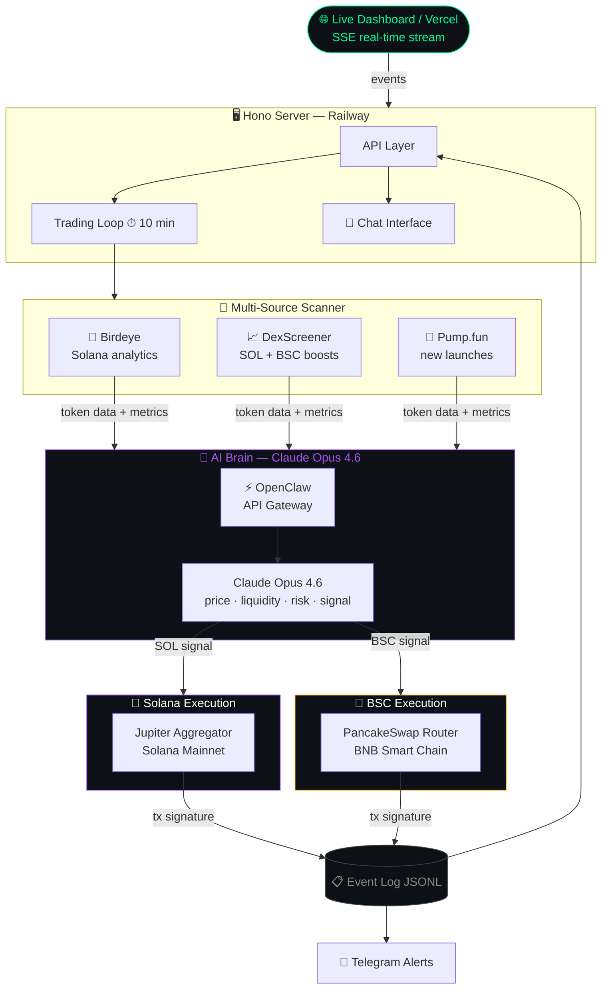

<div align="center">


# ENIZZY TRADER

**Autonomous AI trading agent — Solana & BSC**

[](https://ui-zeta-roan.vercel.app)
[](https://actavis-agent-production.up.railway.app/health)
[](#)
[](#)
[](#)
[](#)
[](#)
[](#)
[](#license)

> **ENIZZY TRADER** runs 24/7 — scanning Birdeye, DexScreener & Pump.fun every 10 minutes across **Solana and BSC**,  
> reasoning through market data with **Claude Opus 4.6** via **OpenClaw**, executing trades autonomously, and sending live alerts to Telegram.

<br/>

[**→ Open Live Dashboard**](https://ui-zeta-roan.vercel.app) &nbsp;·&nbsp; [**→ Health Check**](https://actavis-agent-production.up.railway.app/health)

</div>

---

## What It Does

```
╔══════════════════════════════════════════════════════════════════════╗
║              ENIZZY TRADER — Every 10 min                           ║
╠══════════════════════════════════════════════════════════════════════╣
║                                                                      ║
║  📡  SCAN              Solana                    BSC                 ║
║      ├── Birdeye    →  token analytics      PancakeSwap pairs        ║
║      ├── DexScreener →  top boosts          BSC trending tokens      ║
║      └── Pump.fun   →  new launches         BEP-20 memecoins         ║
║                                  │                                   ║
║  🧠  THINK                       ▼                                   ║
║      Claude Opus 4.6  (via OpenClaw) analyzes:                       ║
║      · price action      · liquidity depth   · volume spike          ║
║      · token age         · holder count      · smart money flow      ║
║      · cross-chain risk  · entry signal      · exit strategy         ║
║                                  │                                   ║
║  💰  ACT                         ▼                                   ║
║      SOL  →  Jupiter Aggregator  →  Solana Mainnet                   ║
║      BSC  →  PancakeSwap Router  →  BNB Smart Chain                  ║
║      HOLD →  update memory & wait next cycle                         ║
║                                  │                                   ║
║  📊  LOG                         ▼                                   ║
║      Event log (JSONL)  ──▶  SSE stream  ──▶  Live UI                ║
║      Telegram alerts   ──▶  instant trade notifications              ║
║                                                                      ║
╚══════════════════════════════════════════════════════════════════════╝
```

No human needed. Fully autonomous.

---

## Tech Stack

| Layer | Technology |
|---|---|
| 🧠 AI Brain | **Claude Opus 4.6** via **OpenClaw** |
| ⛓️ Chains | **Solana Mainnet** + **BNB Smart Chain** |
| 🔄 Execution | Jupiter Aggregator (SOL) · PancakeSwap (BSC) |
| 📡 Scanner | Birdeye · DexScreener · Pump.fun |
| 🖥️ Backend | Node 22 + TypeScript + Hono |
| 🌐 Frontend | React 18 + Vite 5 + Framer Motion |
| 🚀 Deploy | Railway (backend) + Vercel (frontend) |
| 📡 Realtime | Server-Sent Events (SSE) |
| 🔔 Alerts | Telegram Bot |

---

## Architecture



---

## AI Brain — Claude Opus 4.6 via OpenClaw

ENIZZY TRADER uses **Claude Opus 4.6** as its sole reasoning engine, accessed through **OpenClaw** — providing structured tool-use loop with persistent memory across cycles:

| Tool | What it does |
|---|---|
| `scan_tokens` | Pulls data from Birdeye, DexScreener, Pump.fun across SOL + BSC |
| `get_positions` | Checks open positions + unrealized PnL on both chains |
| `buy_token_sol` | Jupiter aggregator swap on Solana mainnet |
| `buy_token_bsc` | PancakeSwap execution on BNB Smart Chain |
| `sell_token` | Exits any position on the respective chain |
| `recall_memory` | Reads notes from previous trading cycles |
| `send_alert` | Pushes trade notifications to Telegram |

Each cycle Claude reasons step-by-step: *"What chain? What token? What's the liquidity? What's my risk exposure across both chains? Buy, hold or exit?"*

---

## Agent Wallet

| Chain | Address |
|---|---|
| Solana | [`F5jWYuiDLTiaLYa54D88YbpXgEsA6NKHzWy4SN4bMYjt`](https://solscan.io/account/F5jWYuiDLTiaLYa54D88YbpXgEsA6NKHzWy4SN4bMYjt) |
| BSC | configured via `BSC_PRIVATE_KEY` env var |

Every trade is executed from this wallet. Every transaction is public and verifiable on-chain.

---

## Trading Engine

| Parameter | Value |
|---|---|
| Cycle interval | 10 minutes |
| Scanner sources | Birdeye + DexScreener + Pump.fun |
| Solana router | Jupiter Aggregator |
| BSC router | PancakeSwap v3 |
| AI model | Claude Opus 4.6 (OpenClaw) |
| Auto-trading | ✅ enabled by default |
| Guard checks | Position size · liquidity · cooldown · cross-chain exposure |

---

## Live Dashboard

| Tab | What you see |
|---|---|
| Overview | Wallet balance (SOL + BSC), PnL, agent status |
| Positions | Open trades with unrealized PnL per chain |
| Scanner | Tokens currently being analyzed |
| Brain | Claude Opus 4.6 reasoning log |
| Event Log | Full event stream |
| Config | Agent parameters |
| Telegram | Live trade alerts & notifications |

**[→ Open Dashboard](https://ui-zeta-roan.vercel.app)**

---

## Quick Start

<details>
<summary><b>🏃 Run locally</b></summary>

```bash
# Prerequisites: Node.js 22+
git clone https://github.com/nur1kmm/enizzy-trader
cd enizzy-trader
npm install
```

Create a `.env` file:

```env
# AI
ANTHROPIC_API_KEY=sk-ant-...
OPENCLAW_API_KEY=your-openclaw-key
AI_MODEL=claude-opus-4-6

# Solana
SOLANA_PRIVATE_KEY=your_base58_private_key
SOLANA_RPC_URL=https://api.mainnet-beta.solana.com
SOLANA_AUTO_TRADING=true

# BSC
BSC_PRIVATE_KEY=your_bsc_private_key
BSC_RPC_URL=https://bsc-dataseed.binance.org
BSC_AUTO_TRADING=true

PORT=3002
```

```bash
# Start backend
npx tsx src/main.ts

# Start frontend (separate terminal)
cd ui && npm install && npm run dev
```

</details>

<details>
<summary><b>🚀 Deploy to Railway + Vercel</b></summary>

**Backend (Railway):**
1. Connect GitHub repo to Railway
2. Railway auto-detects `Dockerfile`
3. Set env vars from `.env.example`

**Frontend (Vercel):**
1. Connect `ui/` subfolder to Vercel
2. Set `VITE_API_URL` to your Railway URL
3. Deploy

</details>

---

## Environment Variables

| Variable | Required | Description |
|---|---|---|
| `ANTHROPIC_API_KEY` | ✅ | Claude Opus 4.6 API key |
| `OPENCLAW_API_KEY` | ✅ | OpenClaw gateway key |
| `SOLANA_PRIVATE_KEY` | ✅ | Base58 Solana wallet private key |
| `BSC_PRIVATE_KEY` | ✅ | BNB Smart Chain wallet private key |
| `SOLANA_RPC_URL` | optional | Custom Solana RPC |
| `BSC_RPC_URL` | optional | Custom BSC RPC |
| `AI_MODEL` | optional | Default: `claude-opus-4-6` |
| `SOLANA_AUTO_TRADING` | optional | Enable Solana trading (default: `true`) |
| `BSC_AUTO_TRADING` | optional | Enable BSC trading (default: `true`) |
| `SOLANA_TRADING_INTERVAL_MINUTES` | optional | Cycle interval (default: `10`) |
| `BIRDEYE_API_KEY` | optional | Birdeye token analytics key |
| `TELEGRAM_BOT_TOKEN` | optional | Telegram bot token |
| `TELEGRAM_CHAT_ID` | optional | Telegram chat ID for alerts |
| `PORT` | optional | HTTP port (default: `3002`) |

---

## Project Structure

<details>
<summary><b>📁 View full structure</b></summary>

```
src/
├── main.ts                    # Entry point
├── core/
│   ├── engine.ts              # Facade → AgentCenter
│   ├── agent-center.ts        # Provider routing + sessions
│   ├── config.ts              # Env-aware config loader
│   ├── event-log.ts           # Append-only JSONL event bus
│   └── tool-center.ts         # Tool registry
├── extension/
│   ├── memecoin-scanner/      # Birdeye + DexScreener + Pump.fun (SOL + BSC)
│   ├── solana-trading/        # Jupiter swap execution
│   ├── bsc-trading/           # PancakeSwap execution
│   └── brain/                 # Claude Opus 4.6 + OpenClaw + memory
├── task/
│   └── trading-loop/          # 10-min autonomous cycle
├── connectors/
│   ├── telegram/              # Trade alert notifications
│   └── web/                   # Hono HTTP + SSE connector
└── plugins/
    └── http.ts                # /health endpoint

ui/
├── src/
│   ├── App.tsx                # Main dashboard shell
│   ├── components/            # Overview, Scanner, Brain, etc.
│   ├── hooks/useSSE.ts        # Live event stream hook
│   └── api.ts                 # REST client
└── public/
    └── logo.png
```

</details>

---

## Disclaimer

> **This is experimental software.** Memecoin trading carries extreme risk of total loss.
> This project is for educational purposes only. Use at your own risk.

---

## License

MIT © 2026 Enizzy Trader

---

<div align="center">

Built with ❤️ &nbsp;·&nbsp; Powered by GPT-4o &amp; Claude Opus 4.6 &nbsp;·&nbsp; Running on Solana

**[Dashboard](https://ui-zeta-roan.vercel.app)** &nbsp;·&nbsp; **[Health](https://actavis-agent-production.up.railway.app/health)**

</div>
